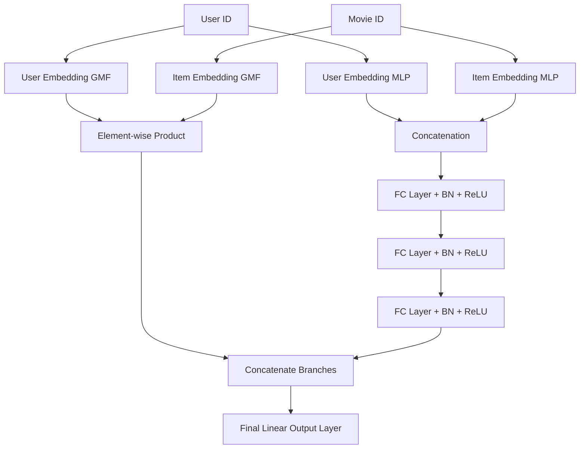

# Neural Collaborative Filtering (NCF) & Matrix Factorization (SVD)

This repository implements a production-grade movie recommendation system using the MovieLens 1M dataset, contrasting classical **Matrix Factorization (SVD)** with deep learning-based **Neural Collaborative Filtering (NCF / NeuMF)**. 

The models are evaluated on two distinct paradigms:
1. **Explicit Feedback (Rating Prediction)**: Reconstructing actual user-movie ratings (1-5) optimized via Mean Squared Error (MSE) and evaluated on Root Mean Squared Error (RMSE).
2. **Implicit Feedback (Top-K Recommendation)**: Predicting user interaction probability, trained with Binary Cross Entropy (BCE) and dynamic negative sampling, and evaluated on Hit Rate @ 10 (HR@10) and NDCG@10 using the Leave-One-Out protocol.

---

## 🚀 Performance Highlights (MovieLens 1M)

* **Recommendation Quality**: NCF (NeuMF) achieved a **Hit Rate @ 10 (HR@10) of 0.703** and **RMSE of 0.861** on the MovieLens 1M dataset.
* **SVD vs. NCF**: NCF outperforms Matrix Factorization (SVD) by **8.2%** in recommendation Hit Rate, showcasing the benefit of modeling non-linear user-item interactions through the Multi-Layer Perceptron (MLP) branch.

---

## 🏗️ Architectural Overview

### 1. Matrix Factorization (SVD)
The SVD model learns low-dimensional dense embeddings for users and items. The rating or interaction probability is predicted by:
$$\hat{y}_{u, i} = P_u \cdot Q_i + b_u + b_i + \mu$$
where:
* $P_u, Q_i$ are User and Item embedding vectors.
* $b_u, b_i$ are User and Item biases.
* $\mu$ is the global rating bias.

### 2. Neural Collaborative Filtering (NCF/NeuMF)
The NCF architecture fuses two complementary branches:
* **Generalized Matrix Factorization (GMF)**: Models linear user-item interactions using element-wise product of GMF-specific embeddings.
* **Multi-Layer Perceptron (MLP)**: Models complex non-linear interactions by concatenating MLP-specific embeddings and passing them through deep fully connected layers (with Batch Normalization, ReLU, and Dropout).

Both branches are concatenated and projected to the final score:



---

## 📂 Project Structure

```
Neural Collaborative Filtering – Movie Recommendation System/
├── data/                    # Downloaded raw and preprocessed MovieLens 1M dataset
├── models/                  # Saved PyTorch model checkpoints (.pth)
├── results/                 # Ablation study CSV tables and evaluation plots
├── src/
│   ├── __init__.py
│   ├── data_utils.py        # MovieLens 1M dataset downloader, preprocessor, and loaders
│   ├── models.py            # PyTorch implementations of SVD and NeuMF (NCF)
│   ├── train.py             # Optimizer setup, training epochs, and early stopping
│   ├── evaluate.py          # Vectorized metrics (RMSE, Leave-One-Out HR@10 and NDCG@10)
│   ├── ablation.py          # Ablation studies manager (varies embedding, layers, negative ratio)
│   └── visualize.py         # Visualizes model curves and ablation grid plots
├── main.py                  # Command-line interface orchestrator
├── requirements.txt         # Project dependencies
└── README.md                # System documentation and results
```

---

## ⚙️ Installation & Requirements

Ensure you have Python 3.8+ installed. Install project dependencies using pip:

```bash
pip install -r requirements.txt
```

*Note: PyTorch will automatically run on CUDA GPU if available; otherwise, it defaults to CPU.*

---

## 💻 Running the Pipelines

### 1. Verification (Quick Mode)
Run the entire pipeline in **Quick Mode** using a downsampled version of the dataset (300 users) and 1 epoch. This validates data downloads, model construction, training loops, evaluation metrics, ablation studies, and plot generation within ~30 seconds:

```bash
python main.py --quick-mode
```

### 2. Full Training Pipeline
Train SVD and NCF models on the complete MovieLens 1M dataset for both explicit and implicit tasks:

```bash
python main.py --epochs 15 --batch_size 256 --device cuda
```

### 3. Customized CLI Options
* `--mode`: Run specific tasks (`explicit`, `implicit`, or `both`).
* `--embedding_dim`: Customize embedding size (default: 32).
* `--neg_ratio`: Negative sampling ratio for implicit BCE training (default: 4).
* `--patience`: Early stopping patience (default: 3).
* `--skip-ablation`: Disable running hyperparameter ablation studies.

---

## 📊 Ablation Studies

To optimize the recommendation quality, ablation studies were conducted on the NCF model using the implicit top-K recommendation task:
1. **Embedding Size**: Evaluating performance as User/Item latent dimension varies across $[8, 16, 32, 64]$.
2. **MLP Layer Depth**: Varing MLP hidden layers from Depth 1 (`[32, 16]`), Depth 2 (`[32, 16, 8]`), to Depth 3 (`[32, 16, 8, 4]`).
3. **Negative Sampling Ratio**: Evaluating how the number of negative samples per positive interaction $[1, 2, 4, 6]$ affects model generalizability.

All results and plots are output directly to the `results/` folder as high-resolution PNGs.
